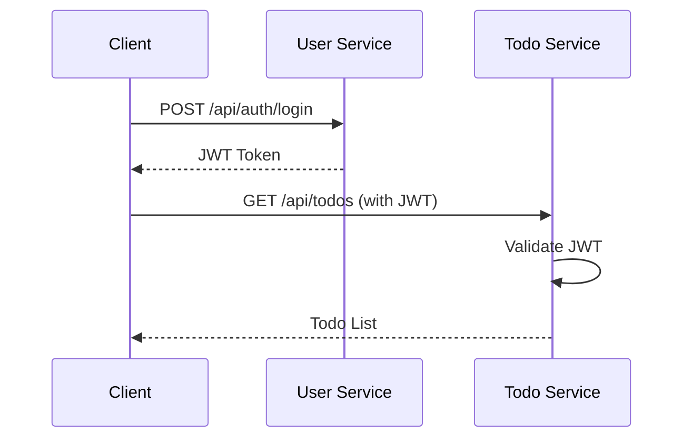

# Todo Microservices Application

A production-ready, full-stack todo application built with microservices architecture using Node.js, TypeScript, React, and MySQL. Features complete Docker containerization and comprehensive test coverage.

## 📋 Table of Contents

- [Architecture Overview](#-architecture-overview)
- [Tech Stack](#-tech-stack)
- [Prerequisites](#-prerequisites)
- [Project Structure](#-project-structure)
- [Installation & Setup](#-installation--setup)
- [Running the Application](#-running-the-application)
- [Docker Deployment](#-docker-deployment)
- [Testing](#-testing)
- [API Documentation](#-api-documentation)
- [Environment Variables](#-environment-variables)
- [Troubleshooting](#-troubleshooting)


## 🏗 Architecture Overview

This application follows a microservices architecture with complete containerization support:

```
┌─────────────────────────────────────────────┐
│                   Nginx                      │
│              (Reverse Proxy)                 │
│                 Port: 80                     │
└────────────────────┬─────────────────────────┘
                     │
         ┌───────────┼───────────┐
         │           │           │
    ┌────▼────┐ ┌────▼────┐ ┌───▼────┐
    │Frontend │ │  User   │ │  Todo  │
    │ (React) │ │ Service │ │Service │
    │   :80   │ │  :3001  │ │ :3002  │
    └─────────┘ └────┬────┘ └───┬────┘
                     │           │
                ┌────▼────┐ ┌────▼────┐
                │  MySQL  │ │  MySQL  │
                │ userdb  │ │ tododb  │
                └─────────┘ └─────────┘
```

### Services:

1. **User Service** - Handles authentication (register/login) and JWT token generation
2. **Todo Service** - Manages CRUD operations for todos with JWT validation
3. **Frontend** - React application with Ant Design UI components
4. **Nginx** - Reverse proxy for routing and serving static files (Docker mode)

## 🛠 Tech Stack

### Backend
- **Runtime**: Node.js (v18+)
- **Language**: TypeScript
- **Framework**: Express.js
- **Database**: MySQL 8.0
- **ORM**: TypeORM
- **Authentication**: JWT (jsonwebtoken)
- **Validation**: Joi
- **Security**: Helmet, CORS, bcrypt
- **Testing**: Jest, Supertest (95% coverage)
- **Containerization**: Docker, Docker Compose

### Frontend
- **Framework**: React 18
- **UI Library**: Ant Design (antd)
- **Routing**: React Router v6
- **HTTP Client**: Axios
- **State Management**: React Hooks
- **Styling**: CSS, Ant Design styles
- **Build**: Create React App

### DevOps
- **Containerization**: Docker, Docker Compose
- **Testing**: Jest, Supertest
- **Code Quality**: ESLint, Prettier

## 📦 Prerequisites

### For Local Development:
- **Node.js** (v16.0.0 or higher)
- **npm** (v7.0.0 or higher)
- **MySQL** (v8.0 or higher)
- **Git**

### For Docker Deployment:
- **Docker** (v20.10.0 or higher)
- **Docker Compose** (v2.0.0 or higher)

### Verify Installation:
```bash
# Local development
node --version    # Should output v16.x.x or higher
npm --version     # Should output v7.x.x or higher
mysql --version   # Should output 8.x.x

# Docker deployment
docker --version
docker-compose --version
```

## 📁 Project Structure

```
todo-microservices/
├── user-service/
│   ├── src/
│   │   ├── config/         # Database and environment config
│   │   ├── controllers/    # Request handlers
│   │   ├── middlewares/    # Custom middleware
│   │   ├── models/         # Database models
│   │   ├── routes/         # API routes
│   │   ├── services/       # Business logic
│   │   ├── utils/          # Utility functions
│   │   ├── validators/     # Input validation schemas
│   │   ├── types/          # TypeScript types
│   │   ├── app.ts          # Express app setup
│   │   └── index.ts        # Entry point
│   ├── tests/
│   │   ├── unit/           # Unit tests
│   │   ├── integration/    # Integration tests
│   │   └── setup.ts        # Test configuration
│   ├── Dockerfile          # Docker configuration
│   ├── Dockerfile.dev      # Development Docker config
│   ├── package.json
│   ├── tsconfig.json
│   ├── jest.config.js
│   ├── .env
│   ├── .dockerignore
│   └── nodemon.json
│
├── todo-service/
│   ├── src/
│   │   └── [Similar structure as user-service]
│   ├── tests/
│   │   └── [Similar structure as user-service]
│   ├── Dockerfile
│   ├── Dockerfile.dev
│   └── [Similar config files]
│
├── frontend/
│   ├── public/
│   ├── src/
│   │   ├── components/     # Reusable components
│   │   ├── pages/          # Page components
│   │   ├── services/       # API services
│   │   ├── utils/          # Utility functions
│   │   ├── App.js          # Main App component
│   │   └── index.js        # Entry point
│   ├── Dockerfile
│   ├── nginx.conf          # Nginx configuration
│   ├── package.json
│   └── .env
│
├── docker-compose.yml       # Production Docker orchestration
├── docker-compose.dev.yml   # Development Docker orchestration
├── Makefile                # Convenience commands
├── init-db/
│   └── init.sql            # Database initialization
└── README.md               # This file
```

## 🚀 Installation & Setup

### Option 1: Quick Start with Docker (Recommended)

```bash
# Clone the repository
git clone <repository-url>
cd todo-microservices

# Create environment file
cp .env.docker .env

# Build and run all services
docker-compose up -d

# Application will be available at:
# - Frontend: http://localhost
# - User Service: http://localhost:3001
# - Todo Service: http://localhost:3002
```

### Option 2: Local Development Setup

#### Step 1: Clone the Repository
```bash
git clone <repository-url>
cd todo-microservices
```

#### Step 2: Setup MySQL Databases
```sql
-- Login to MySQL
mysql -u root -p

-- Create databases
CREATE DATABASE IF NOT EXISTS userdb;
CREATE DATABASE IF NOT EXISTS tododb;

-- Create users
CREATE USER IF NOT EXISTS 'userservice'@'localhost' IDENTIFIED BY 'userpass123';
CREATE USER IF NOT EXISTS 'todoservice'@'localhost' IDENTIFIED BY 'todopass123';

-- Grant privileges
GRANT ALL PRIVILEGES ON userdb.* TO 'userservice'@'localhost';
GRANT ALL PRIVILEGES ON tododb.* TO 'todoservice'@'localhost';
FLUSH PRIVILEGES;

EXIT;
```

#### Step 3: Setup and Run Services
```bash
# User Service
cd user-service
npm install
cp .env.example .env  # Edit with your config
npm run dev

# Todo Service (new terminal)
cd todo-service
npm install
cp .env.example .env  # Edit with your config
npm run dev

# Frontend (new terminal)
cd frontend
npm install
cp .env.example .env  # Edit with your config
npm start
```

## 🐳 Docker Deployment

### Production Deployment

```bash
# Build and start all services
docker-compose up -d

# View logs
docker-compose logs -f

# Stop all services
docker-compose down

# Rebuild after code changes
docker-compose up -d --build
```

### Development with Hot Reload

```bash
# Use development compose file
docker-compose -f docker-compose.dev.yml up

# Services will auto-reload on code changes
```

### Docker Commands Reference

```bash
# Build images
docker-compose build

# Start services in background
docker-compose up -d

# View running containers
docker-compose ps

# View logs for specific service
docker-compose logs -f user-service

# Execute command in container
docker-compose exec user-service sh

# Stop and remove everything
docker-compose down -v

# Rebuild specific service
docker-compose up -d --build user-service
```

### Using Makefile

```bash
make help        # Show available commands
make build       # Build all images
make up          # Start all services
make down        # Stop all services
make logs        # View logs
make test        # Run all tests
make clean       # Clean up everything
```

## 🧪 Testing

### Test Coverage Summary

- **User Service**: 20 test cases covering authentication
- **Todo Service**: 34 test cases covering CRUD operations
- **Total Coverage**: >90% code coverage

### Running Tests

#### All Tests
```bash
# User Service
cd user-service
npm test

# Todo Service
cd todo-service
npm test
```

#### Test Categories

```bash
# Unit tests only
npm run test:unit

# Integration tests only
npm run test:integration

# Tests with coverage report
npm run test:coverage

# Tests in watch mode
npm run test:watch
```

#### Test in Docker

```bash
# Run tests in Docker containers
docker-compose exec user-service npm test
docker-compose exec todo-service npm test

# Or use Makefile
make test
```

### Test Database Setup

```sql
-- Create test databases
CREATE DATABASE IF NOT EXISTS test_userdb;
CREATE DATABASE IF NOT EXISTS test_tododb;

-- Grant permissions
GRANT ALL PRIVILEGES ON test_userdb.* TO 'root'@'localhost';
GRANT ALL PRIVILEGES ON test_tododb.* TO 'root'@'localhost';
FLUSH PRIVILEGES;
```

### Test Examples

#### User Registration Test
```typescript
it('Should register a new user with valid credentials', async () => {
  const response = await request(app)
    .post('/api/auth/register')
    .send({
      email: 'test@example.com',
      password: 'Test123'
    })
    .expect(201);

  expect(response.body.success).toBe(true);
  expect(response.body.data).toHaveProperty('token');
});
```

#### Todo CRUD Test
```typescript
it('Should create a todo for authenticated user', async () => {
  const response = await request(app)
    .post('/api/todos')
    .set('Authorization', `Bearer ${validToken}`)
    .send({ content: 'Test todo' })
    .expect(201);

  expect(response.body.data.content).toBe('Test todo');
});
```

## 📚 API Documentation

### Base URLs
- **User Service**: `http://localhost:3001`
- **Todo Service**: `http://localhost:3002`

### Authentication Flow



### Endpoints Summary

#### User Service
| Method | Endpoint | Description | Auth Required |
|--------|----------|-------------|---------------|
| POST | `/api/auth/register` | Register new user | No |
| POST | `/api/auth/login` | Login user | No |
| GET | `/health` | Health check | No |

#### Todo Service
| Method | Endpoint | Description | Auth Required |
|--------|----------|-------------|---------------|
| POST | `/api/todos` | Create todo | Yes |
| GET | `/api/todos` | Get all todos | Yes |
| GET | `/api/todos/:id` | Get single todo | Yes |
| PUT | `/api/todos/:id` | Update todo | Yes |
| DELETE | `/api/todos/:id` | Delete todo | Yes |
| GET | `/health` | Health check | No |

### Postman Collection

Import the complete Postman collection from `api-docs/postman-collection.json` for easy API testing.

### Example Requests

#### Register User
```bash
curl -X POST http://localhost:3001/api/auth/register \
  -H "Content-Type: application/json" \
  -d '{"email": "user@example.com", "password": "Test123"}'
```

#### Create Todo
```bash
curl -X POST http://localhost:3002/api/todos \
  -H "Content-Type: application/json" \
  -H "Authorization: Bearer YOUR_JWT_TOKEN" \
  -d '{"content": "Complete project"}'
```

## 🔧 Environment Variables

### User Service (.env)

```env
NODE_ENV=development
PORT=3001
DB_HOST=localhost
DB_PORT=3306
DB_USER=userservice
DB_PASSWORD=userpass123
DB_NAME=userdb
JWT_SECRET=your-super-secret-jwt-key
JWT_EXPIRES_IN=24h
ALLOWED_ORIGINS=http://localhost:3000
```

### Todo Service (.env)

```env
NODE_ENV=development
PORT=3002
DB_HOST=localhost
DB_PORT=3306
DB_USER=todoservice
DB_PASSWORD=todopass123
DB_NAME=tododb
JWT_SECRET=your-super-secret-jwt-key  # Must match User Service
ALLOWED_ORIGINS=http://localhost:3000
```

### Frontend (.env)

```env
REACT_APP_USER_SERVICE_URL=http://localhost:3001
REACT_APP_TODO_SERVICE_URL=http://localhost:3002
```

### Docker Environment (.env.docker)

```env
# MySQL
MYSQL_ROOT_PASSWORD=rootpass123

# Services
NODE_ENV=production
JWT_SECRET=your-super-secret-jwt-key
JWT_EXPIRES_IN=24h

# Ports
USER_SERVICE_PORT=3001
TODO_SERVICE_PORT=3002
FRONTEND_PORT=80
```

## 🐛 Troubleshooting

### Common Issues and Solutions

#### Docker Issues

**Container won't start:**
```bash
# Check logs
docker-compose logs service-name

# Rebuild from scratch
docker-compose down -v
docker-compose up --build
```

**Database connection fails:**
```bash
# Wait for MySQL to be ready
docker-compose exec mysql-db mysqladmin ping -h localhost

# Check database exists
docker-compose exec mysql-db mysql -u root -prootpass123 -e "SHOW DATABASES;"
```

#### Testing Issues

**Tests failing with "Field 'uuid' doesn't have a default value":**
```bash
# Ensure test database has correct schema
npm run test:setup

# Or manually sync schema
npm run typeorm schema:sync
```

**JWT token mismatch:**
- Ensure both services use the same JWT_SECRET
- Check token expiration time

#### Development Issues

**CORS errors:**
```javascript
// Update ALLOWED_ORIGINS in .env
ALLOWED_ORIGINS=http://localhost:3000,http://localhost:8080

// Restart services after change
```

**Port already in use:**
```bash
# Find and kill process
lsof -i :3001  # Mac/Linux
kill -9 <PID>

# Or change port in .env
PORT=3003
```

### Development Guidelines

- Write tests for all new features
- Maintain >80% code coverage
- Follow TypeScript best practices
- Use ESLint and Prettier for code formatting
- Update documentation for API changes


## 👥 Authors

- **Ahmad Anis** - Initial work and architecture

## 🙏 Acknowledgments

- Built as a technical challenge demonstrating microservices architecture
- Implements industry best practices for Node.js and React development
- Features comprehensive test coverage and Docker containerization
- Follows RESTful API design principles
- Implements proper authentication and authorization with JWT

## 📊 Project Status

- ✅ Core functionality complete
- ✅ Docker containerization implemented
- ✅ Comprehensive test suite (54+ test cases)
- ✅ Production-ready with security best practices
- 🚧 CI/CD pipeline (optional enhancement)
- 🚧 Kubernetes deployment (future enhancement)

---

**Happy Coding! 🚀**

For questions or support, please open an issue in the repository.
